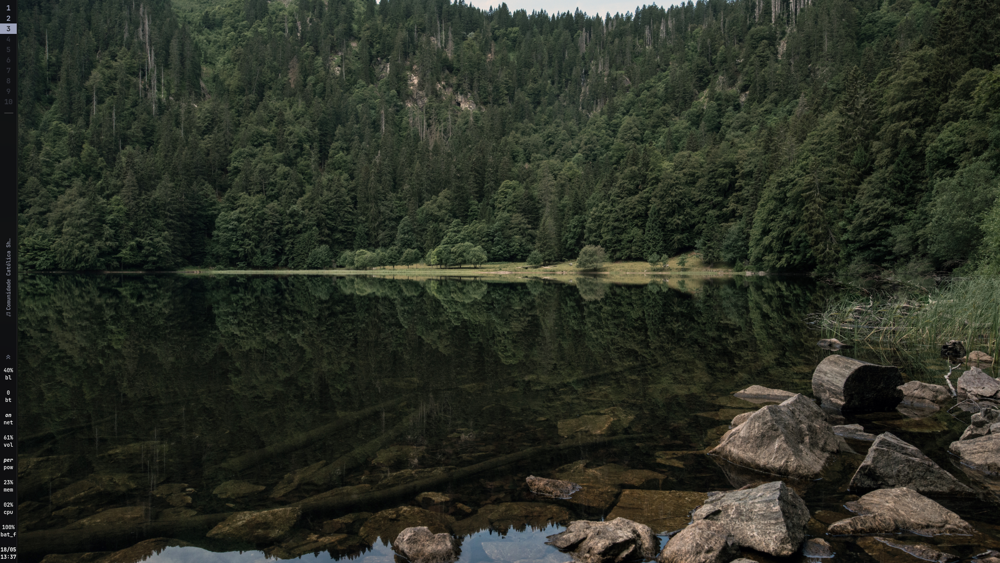

# Liquid Glass

A dark, transparent "glass" theme for Omarchy with a Sonokai-inspired palette.

This theme features glassmorphic backgrounds with heavy blur, subtle transparency, and cool neon accents.



## Installation

To install this theme, use the Omarchy CLI:

```bash
omarchy theme install https://github.com/Luquatic/omarchy-catppuccin-glass
```

Or via the Omarchy menu:

`Omarchy menu > Install > Style > Theme`

## Starship

For the same terminal look, copy the `starship.toml` into your `~/.config` directory.

## Credits

This theme is inspired by the [Sonokai](https://github.com/sainnhe/sonokai) color palette. Special thanks to the Sonokai team for creating a beautiful and high-contrast scheme!
